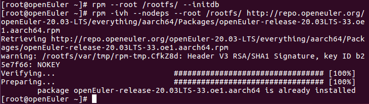
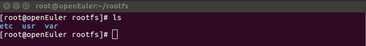
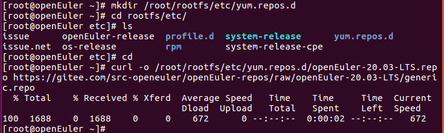
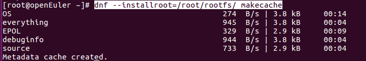
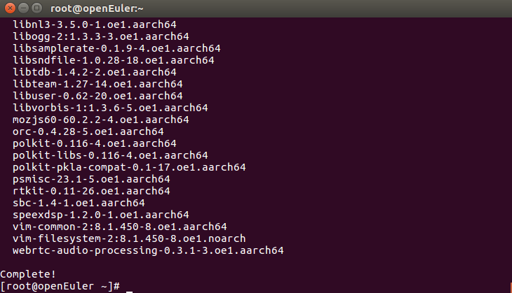
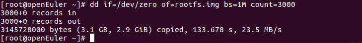
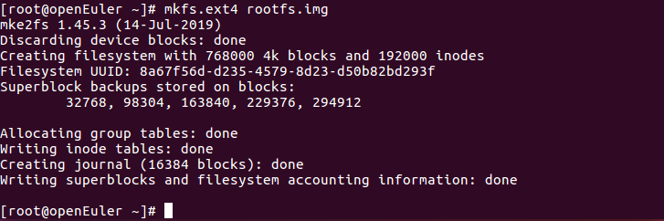
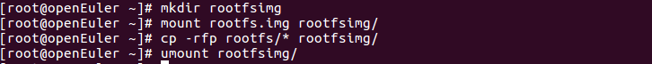
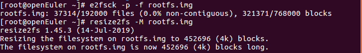

<!-- TOC -->

- [准备编译环境](#准备编译环境)
- [制作 rootfs 镜像](#制作-rootfs-镜像)
  - [创建 RPM 数据库](#创建-rpm-数据库)
  - [下载安装 openEuler 发布包](#下载安装-openeuler-发布包)
  - [添加 yum 源](#添加-yum-源)
  - [安装 dnf](#安装-dnf)
  - [安装必要软件](#安装必要软件)
  - [添加配置文件](#添加配置文件)
  - [rootfs 设置](#rootfs-设置)

<!-- /TOC -->

# 准备编译环境

- 操作系统：openEuler
            
- 架构：  AArch64
        
                
**说明:本文档选择装有openeuler系统的树莓派进行说明。**


# 制作 rootfs 镜像

## 创建 RPM 数据库
```    
mkdir rootfs
mkdir -p rootfs/var/lib/rpm
rpm --root  /rootfs/ --initdb
```

## 下载安装 openEuler 发布包
```
rpm -ivh --nodeps --root /root/rootfs/ http://repo.openeuler.org/openEuler-20.03-LTS/everything/aarch64/Packages/openEuler-release-20.03LTS-33.oe1.aarch64.rpm
```



在/root/rootfs下生成3个文件夹：




## 添加 yum 源

```
mkdir /root/rootfs/etc/yum.repos.d`
curl -o /root/rootfs/etc/yum.repos.d/openEuler-20.03-LTS.repo https://gitee.com/src-openeuler/openEuler-repos/raw/openEuler-20.03-LTS/generic.repo
```



## 安装 dnf

`dnf --installroot=/root/rootfs/ install dnf --nogpgcheck -y`  （多执行几次）


## 安装必要软件

`dnf --installroot=/root/rootfs/ makecache`



`dnf --installroot=/root/rootfs/ install -y alsa-utils wpa_supplicant vim net-tools iproute iputils NetworkManager openssh-server passwd hostname ntp bluez pulseaudio-module-bluetooth`



## 添加配置文件

1.  设置 DNS
    ```
    cp -L /etc/resolv.conf ${WORKDIR}/rootfs/etc/resolv.conf
    vim ${WORKDIR}/rootfs/etc/resolv.conf
    ```
    添加内容：
    ```
    nameserver 8.8.8.8
    nameserver 114.114.114.114
    ```
2. 设置 IP 自动获取

    ```
    mkdir ${WORKDIR}/rootfs/etc/sysconfig/network-scripts
    vim ${WORKDIR}/rootfs/etc/sysconfig/network-scripts/ifup-eth0
    ```
    内容：
    ```
    TYPE=Ethernet
    PROXY_METHOD=none
    BROWSER_ONLY=no
    BOOTPROTO=dhcp
    DEFROUTE=yes
    IPV4_FAILURE_FATAL=no
    IPV6INIT=yes
    IPV6_AUTOCONF=yes
    IPV6_DEFROUTE=yes
    IPV6_FAILURE_FATAL=no
    IPV6_ADDR_GEN_MODE=stable-privacy
    NAME=eth0
    UUID=851a6f36-e65c-3a43-8f4a-78fd0fc09dc9
    ONBOOT=yes
    AUTOCONNECT_PRIORITY=-999
    DEVICE=eth0
    ```
3.  拷贝 wifi 配置文件，蓝牙启动文件

    1.  下载 [无线配置目录](../scripts/config/wireless) 到  WORKDIR

    2.  拷贝文件 :
        ```
        mkdir  ${WORKDIR}/rootfs/system
        cp -r ${WORKDIR}/wireless/system/*    ${WORKDIR}/rootfs/system/
        cp   ${WORKDIR}/wireless/rcS.sh    ${WORKDIR}/rootfs/etc/profile.d/
        cp   ${WORKDIR}/wireless/enable_bt    ${WORKDIR}/rootfs/usr/bin/
        chmod +x  ${WORKDIR}/rootfs/usr/bin/enable_bt  ${WORKDIR}/rootfs/etc/profile.d/rcS.sh
        ```
## rootfs 设置

1.  挂载必要的路径
    ```
    mount --bind /dev ${WORKDIR}/rootfs/dev
    mount -t proc /proc ${WORKDIR}/rootfs/proc
    mount -t sysfs /sys ${WORKDIR}/rootfs/sys
    ```

2.  run chroot

    `chroot ${WORKDIR}/rootfs /bin/bash`
    

3.  设置 root 密码
    
    `passwd root`

    输入要设置的 root 密码。

4.  设置主机名
    
    `echo openEuler > /etc/hostname`

5.  设置默认时区为东八区

    `ln -s /usr/share/zoneinfo/Asia/Shanghai /etc/localtime`

6.  退出
    
    `exit`

7.  取消临时挂载的目录

    ```
    umount -l ${WORKDIR}/rootfs/dev
    umount -l ${WORKDIR}/rootfs/proc
    umount -l ${WORKDIR}/rootfs/sys
    ```

8.  制作镜像

    1.  dd 创建镜像：

        `dd if=/dev/zero of=rootfs.img bs=1M count=3000`

        
    2.  格式化镜像：

        `mkfs.ext4 rootfs.img`

        
    3.  挂载镜像：
   
        ```   
        mkdir rootfsimg
        mount rootfs.img rootfsimg/
        cp -rfp rootfs/* rootfsimg/
        ```

    4.  卸载镜像

        `umount rootfsimg/`

        

    5. 镜像压缩

        ```
        e2fsck -p -f rootfs.img  
        resize2fs -M rootfs.img
        ```
        

