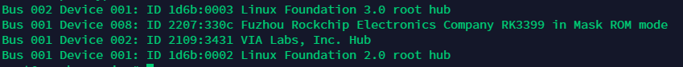

<!-- TOC -->

- [描述](#描述)
- [进入 loader 模式](#进入-loader-模式)
- [使用 Windows 刷写](#使用-Windows-刷写)
- [使用 Linux 刷写](#使用-Linux-刷写)

<!-- /TOC -->

# 描述

本文档介绍了如何将 EMMC 刷写文件刷写入 EMMC。

# 使用 Windows 刷写

1.  下载 [RKDevTool 工具](http://www.t-firefly.com/doc/download/page/id/3.html#other_374)。

2.  切换至下载镜像页，勾选需要烧录的分区，可以多选。

3.  确保映像文件的路径和刷入地址正确，点击路径右边的空白表格单元格选择对应的文件。

    

4.  进入 Loader 模式

    1.  Type-C data cable 连接好设备和主机。

    2.  使设备进入升级模式。
        - 按住设备上的 RECOVERY （恢复）键并保持
        - 短按一下 RESET（复位）键
        - 大约两秒钟后，松开 RECOVERY 键

        

4.  点击执行按钮开始升级，升级结束后设备会自动重启。

# 使用 Linux 刷写

1.  生成的分立刷写文件压缩包为 output 下的 openEuler-VERSION-BOARD-RELEASE.tar.gz，将其解压。

2.  编译安装 rkdeveloptool ，具体可以参考 [Rockchip 官方 wiki - rkdeveloptool](http://opensource.rock-chips.com/wiki_Rkdeveloptool)
    
    1.  下载源码

        `git clone https://github.com/rockchip-linux/rkdeveloptool.git`

    2.  编译安装

        `autoreconf -i`

        `./configure`

        `make`

        `make install`


3.  进入系统后，在开发板上清除 EMMC 上的引导程序，使设备进入 maskrom 模式
    
    `dd if=/dev/zero of=/dev/mmcblk0 bs=1M count=8`

    然后将设备连接至主机，使用 `lsblk` 命令看到以下信息即成功进入 MaskRom Mode

    ```
    Bus 001 Device 008: ID 2207:330c Fuzhou Rockchip Electronics Company RK3399 in Mask ROM mode
    ```

    

4.  然后将系统刷写进 EMMC，如下：

```
cd output
rkdeveloptool db rk3399_loader.bin
rkdeveloptool gpt parameter.gpt
rkdeveloptool wl 0x40 idbloader.img
rkdeveloptool wl 0x4000 u-boot.itb
rkdeveloptool wl 0x8000 boot.img
rkdeveloptool wl 0x40000 rootfs.img
rkdeveloptool rd
```