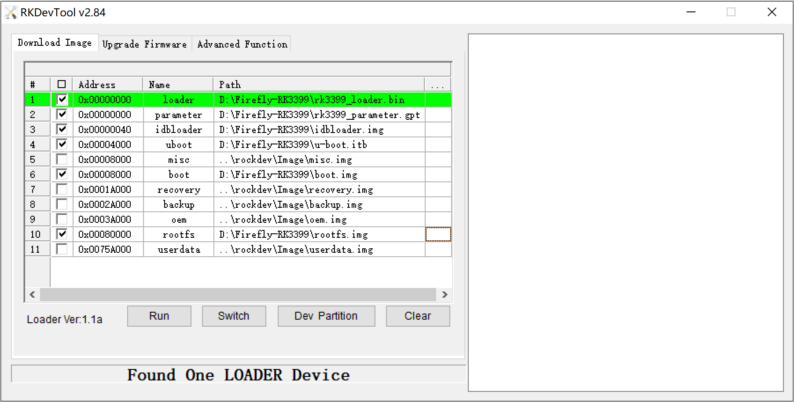
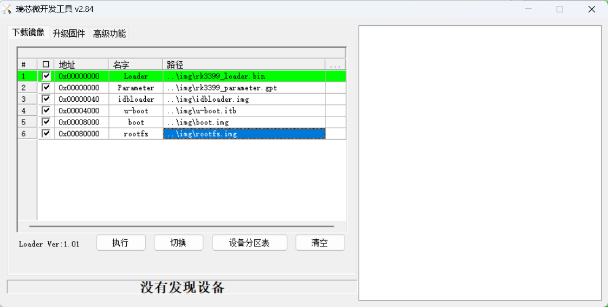
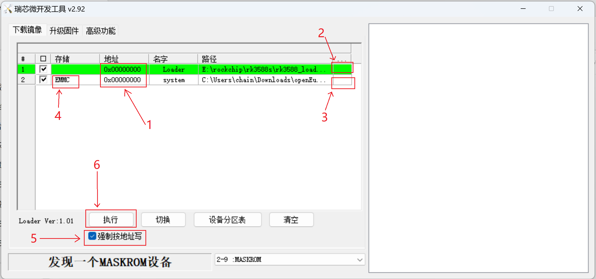

- [描述](#描述)
- [使用 Windows 刷写](#使用-windows-刷写)
  - [RK3399 刷写过程](#rk3399-刷写过程)
  - [RK3588 刷写过程](#rk3588-刷写过程)
- [使用 Linux 刷写](#使用-linux-刷写)
- [使用 SD 镜像启动后进入系统刷写](#使用-SD-镜像启动后进入系统刷写)

# 描述

本文档以为 Firefly ROC-RK3588S-PC 开发板刷写镜像为例，介绍了如何将 EMMC 刷写文件刷写入 EMMC。

# 使用 Windows 刷写

## RK3399 刷写过程

1.  生成的刷写文件压缩包为 build 下的 openEuler-VERSION-BOARD-RELEASE.tar.gz，将其解压。

2.  下载 [RKDevTool 工具](http://www.t-firefly.com/doc/download/page/id/3.html#other_374)。

3.  进入 Loader 模式

    1.  使用 Type-C data cable 连接好开发板和主机。

    2.  使开发板进入 Loader 模式。
        - 按住开发板上的 RECOVERY （恢复）键并保持
        - 短按一下 RESET（复位）键
        - 大约两秒钟后，松开 RECOVERY 键

        

4.  切换至下载镜像页，勾选需要烧录的分区，可以多选。

5.  确保映像文件的路径和刷入地址正确，点击路径右边的空白表格单元格选择对应的文件。

    

6.  点击执行按钮开始升级，升级结束后开发板会自动重启。

## RK3588 刷写过程

1.  刷写所需要的文件：
    
    1.  生成的刷写文件压缩包为 build 下或项目主页发布的的压缩后的 RAW 原始镜像（需要解压）：openEuler-VERSION-BOARD-RELEASE.img.xz。

    2.  项目主页 scripts/bin 目录下提供的 [rk3588_loader.bin](../scripts/bin/rk3588_loader.bin)。

2.  下载版本不小于 2.92 的 [RKDevTool 工具](https://dl.radxa.com/tools/windows/windows_RKDevTool_Release_v2.92.zip)。

3.  进入 Maskrom 模式

    1.  使用 Type-C data cable 连接好开发板和主机。

    2.  使开发板进入 Maskrom 模式。
        - 按住开发板上的 Maskrom 键并保持
        - 插上电源线
        - 在 RKDevTool 显示“发现一个 MASKROM 设备后”，松开 Maskrom 键

4.  切换至下载镜像页，勾选需要烧录的分区，可以多选。

5.  按照图片顺序进行操作：

    1.  两者地址都为 `0x00000000`，确保刷入地址正确。

    2.  点击路径右边的空白表格单元格选择 rk3588_loader.bin。

    3.  点击路径右边的空白表格单元格选择 openEuler-VERSION-BOARD-RELEASE.img。

    4.  双击 system 项目的“储存”栏，选择储存为 EMMC。

    5.  勾选“强制按地址写”。

    6.  点击执行，开始刷写。

    

6.  刷写成功界面如下，刷写结束后开发板会自动重启。

    

# 使用 Linux 刷写

1.  本方法仅支持 RK3399。

2.  生成的刷写文件压缩包为 build 下的 openEuler-VERSION-BOARD-RELEASE.tar.gz，将其解压。

3.  编译安装 rkdeveloptool ，具体可以参考 [Rockchip 官方 wiki - rkdeveloptool](http://opensource.rock-chips.com/wiki_Rkdeveloptool)
    
    1.  下载源码

        `git clone https://github.com/rockchip-linux/rkdeveloptool.git`

    2.  编译安装

        `cd rkdeveloptool`

        `autoreconf -i`

        `./configure`

        `make`

        `make install`


4.  开发板开机，登录到开发板后，清除 EMMC 上的引导程序，此时开发板会自动进入 maskrom 模式

    ```
    dd if=/dev/zero of=/dev/mmcblk0 bs=1M count=8
    reboot
    ```

    使用 Type-C data cable 连接好开发板和主机，使用 `lsblk` 命令看到以下信息即为成功进入 Maskrom Mode

    RK3399 显示如下
    

5.  刷写镜像等文件到 EMMC，如下:

    ```
    cd build
    rkdeveloptool db rk3399_loader.bin
    rkdeveloptool gpt rk3399_parameter.gpt
    rkdeveloptool wl 0x40 idbloader.img
    rkdeveloptool wl 0x4000 u-boot.itb
    rkdeveloptool wl 0x8000 boot.img
    rkdeveloptool wl 0x80000 rootfs.img
    rkdeveloptool rd
    ```

# 使用 SD 镜像启动后进入系统刷写

1.  确保能使用 SD 镜像成功启动并进入系统，此处不限系统，例如 Firefly/Radxa 提供的官方 Debian/Ubuntu 系统。

2.  准备好项目主页提供或者根据项目脚本生成的`压缩后的 SD 卡启动文件`。

3.  使用 `lsblk` 查找并确认 EMMC 盘符，使用 SD 镜像启动后的 EMMC 盘符通常同时符合以下两个特点：

    1.  盘符以 `mmcblk` 开头。

    2.  未被挂载为根目录和 `/boot` 目录。

4.  刷写系统。（在 Firefly ROC-RK3588S-PC 和 Firefly ITX-RK3588 上，EMMC 盘符为 `mmcblk0`，此处以 `mmcblk0`为例）

    `xzcat openEuler-VERSION-BOARD-ARCH-RELEASE.img.xz | dd of=/dev/mmcblk0 status=prgress`

5.  关机后取下 SD 卡，然后再启动开发板即可。