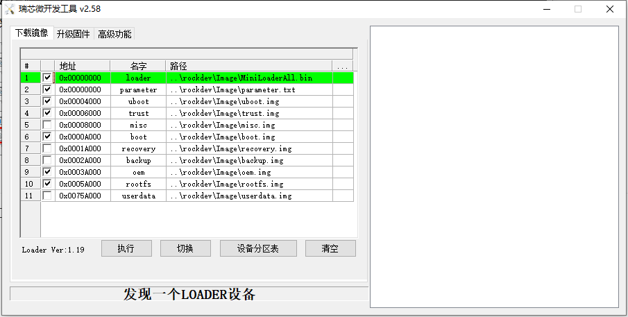
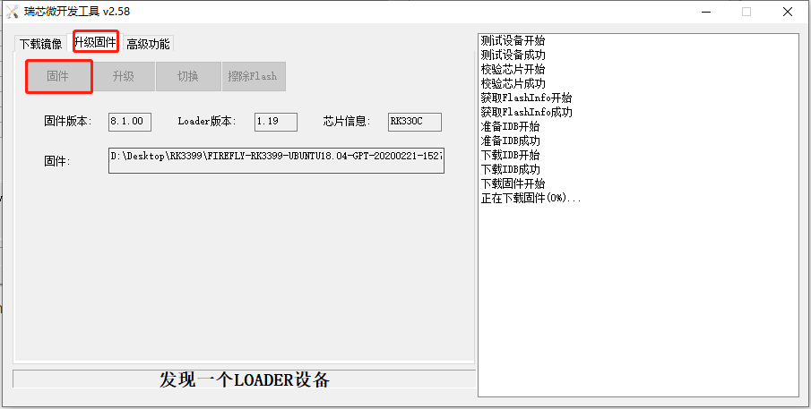

<!-- TOC -->

- [进入 loader 模式](#进入-loader-模式)
- [烧写分区映像](#烧写分区映像)
- [烧写统一固件](#烧写统一固件)

<!-- /TOC -->

# 进入 loader 模式

1.  下载 [RKDevTool 工具](http://www.t-firefly.com/doc/download/page/id/3.html#other_374)。
 
2.  Type-C data cable 连接好设备和主机。

3.  使设备进入升级模式。
    - 按住设备上的 RECOVERY （恢复）键并保持
    - 短按一下 RESET（复位）键
    - 大约两秒钟后，松开 RECOVERY 键

# 烧写分区映像

1.  切换至下载镜像页。

2.  勾选需要烧录的分区，可以多选。

3.  确保映像文件的路径正确，需要的话，点路径右边的空白表格单元格来重新选择。

4.  点击执行按钮开始升级，升级结束后设备会自动重启。
   

# 烧写统一固件

1.  切换至升级固件页。
   
2.  按固件按钮，打开要升级的固件文件。

3.  按升级按钮开始升级。
   

